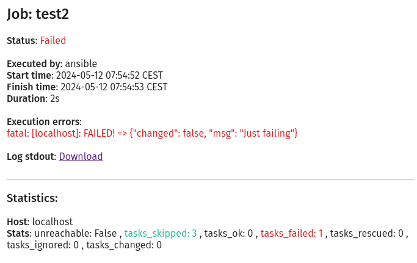

.. _usage_alerts:

.. include:: ../_include/head.rst

.. include:: ../_include/warn_develop.rst

======
Alerts
======

You can use the UI at :code:`Settings - Alerts` to create alerting rules for your jobs.

Options are:

* **User** specific rule - only you are notified

* **Group** rules - all members of a specific group are notified (*if they have the privilege to view the job*)

* **Global** rules - all users are notified (*if they have the privilege to view the job*)

There are currently two types of alerts: E-Mail and plugins.

----

E-Mail
******

You need to configure your mailserver at the :code:`System - Config` page.

After that you can receive e-mails on job finish/failure.

**Example Mail**:

|alert_email|

----

Plugins
*******

There is a generic alert-plugin interface for custom solutions.

**Usage**:

* Create a script that can be called by AW

   It will receive a file-path as system-argument 1 that points to a JSON file containing data you might want to use.

    Example JSON:

    .. code-block:: json

        {
          "alert": {
            "type": "user",
            "condition": "always"
          },
          "user": {
            "name": "ansible",
            "first_name": "",
            "last_name": "",
            "email": "guy@ansibleguy.net",
            "phone": null,
            "description": "test",
            "is_active": true,
            "last_login": 1715487270,
            "groups": []
          },
          "execution": {
            "failed": true,
            "status": "Failed",
            "job_name": "test2",
            "user_name": "ansible",
            "time_start": 1715502006,
            "time_start_pretty": "2024-05-12 08:20:06 CEST",
            "time_fin": 1715502007,
            "time_fin_pretty": "2024-05-12 08:20:07 CEST",
            "time_duration": 0.845428,
            "time_duration_pretty": "1s",
            "error_short": null,
            "error_med": null,
            "log_stdout": "/home/guy/.local/share/ansible-webui/test2_2024-05-12_08-20-06_ansible_stdout.log",
            "log_stdout_url": "http://localhost:8000/api/job/1/85/log?type=stdout",
            "log_stderr": null,
            "log_stderr_url": null,
            "log_stdout_repo": null,
            "log_stdout_repo_url": null,
            "log_stderr_repo": null,
            "log_stderr_repo_url": null
          },
          "errors": {
            "html": [
              "fatal: [localhost]: FAILED! => {\"changed\": false, \"msg\": \"Just failing\"}\n"
            ],
            "text": [
              "fatal: [localhost]: FAILED! = {changed: false, msg: Just failing}"
            ]
          },
          "stats": {
            "localhost": {
              "unreachable": false,
              "tasks_skipped": 3,
              "tasks_ok": 0,
              "tasks_failed": 1,
              "tasks_rescued": 0,
              "tasks_ignored": 0,
              "tasks_changed": 0
            }
          }
        }

* Create a plugin at :code:`Settings - Alerts` that points to your executable

* Link the plugin in alerts

* You can use the user attributes :code:`phone` and :code:`description` to add user-specific information your script might need.

* Test it

----

Example Plugin
==============

    .. code-block:: python3

        #!/usr/bin/env python3

        from sys import argv
        from sys import exit as sys_exit
        from json import loads as json_loads

        with open(argv[1], 'r', encoding='utf-8') as _f:
            data = json_loads(_f.read())

        # implement alerting

        if data['execution']['failed']:
            # failure action

            for host, stats in data['stats'].items():
                if stats['unreachable'] or stats['tasks_failed'] > 0:
                    # hosts that failed
                    pass

        sys_exit(0)
