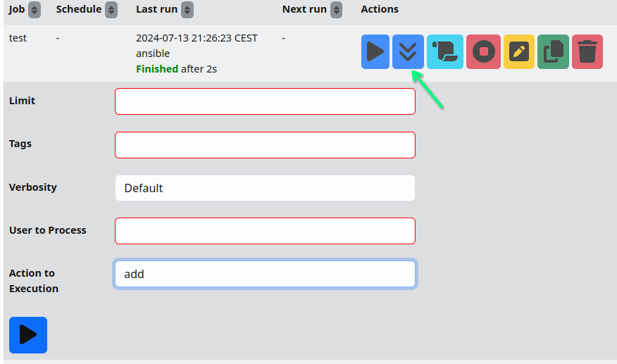
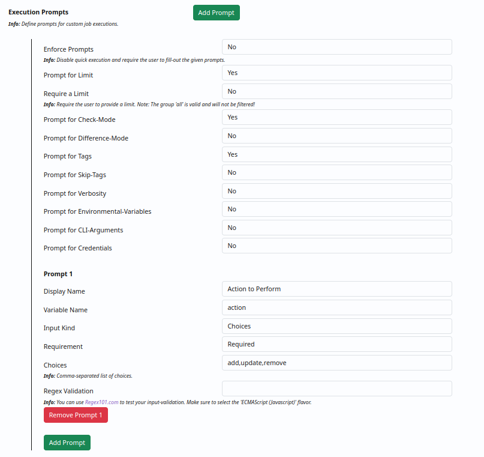
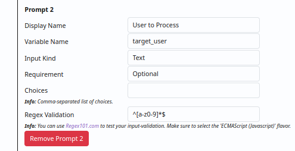

.. _usage_jobs:

.. include:: ../_include/head.rst

.. include:: ../_include/warn_develop.rst

====
Jobs
====

You can use the UI at :code:`Jobs - Manage` to create and execute jobs.

----

Create
******

To get an overview - Check out the demo at: `demo.webui.ansibleguy.net <https://demo.webui.ansibleguy.net>`_ | Login: User :code:`demo`, Password :code:`Ansible1337`

The job creation form will help you by browsing for playbooks and inventories. For this to work correctly - you should first select the repository to use (*if any is in use*).

You can optionally define a :code:`schedule` in `Cron-format <https://crontab.guru/>`_ to automatically execute the job. Schedule jobs depend on :ref:`Global Credentials <usage_credentials>` (*if any are needed*).

:code:`Credential categories` can be defined if you want to use user-specific credentials to manage your systems. The credentials of the executing user will be dynamically matched if the job is set to :code:`Needs credentials`.

For transparency - the full command that is executed is added on the logs-view.

----

Execute
*******

You have two options to execute a job:

* **Quick execution** - run job as configured without overrides

* **Custom execution** - run job with execution-specific overrides

    The fields available as overrides can be configured in the job settings!

    |job_prompts1|

    |job_prompts2|

    These will be shown in the job overview:

    |job_exec|
